# Gotar Bot (pi-web-ui)

A mobile-first Rails/Hotwire web UI for chatting with the **pi** coding agent.

Key goals:
- fast, phone-friendly chat UX (PWA)
- transparent agent execution (streaming + tool timeline)
- scheduled automation (cron-like jobs)
- shared, persistent personal knowledge (`~/.pi/knowledge`) indexed by **QMD**


## Architecture (how it works)

```mermaid
flowchart TD
  subgraph Device[User Device]
    Browser[Mobile Safari / Desktop Browser<br/>Turbo + Stimulus]
    SW[Service Worker<br/>PWA cache + push handler]
  end

  subgraph Web["Rails Web Process (Puma)"]
    Controllers[Controllers<br/>Chat / Knowledge / Monitoring]
    Cable[Turbo Streams<br/>(Solid Cable)]
    Views[Hotwire UI<br/>Turbo Frames]
  end

  subgraph Jobs["Rails Jobs Process (Solid Queue workers)"]
    SQ[Solid Queue]
    PiStream[PiStreamJob<br/>(streams assistant)]
    SchedTick[ScheduledJobTickJob<br/>(enqueue due jobs)]
    SchedRun[ScheduledJobRunnerJob<br/>(run template)]
    KBSearch[KnowledgeSearchJob<br/>(async heavy QMD)]
    Heartbeat[SystemHeartbeatJob<br/>(stuck recovery + optional LLM check)]
    Polish[PersonalKnowledgePolishJob<br/>(rewrite living docs)]
    Reindex[PersonalKnowledgeReindexJob<br/>(import sessions + qmd update/embed)]
  end

  subgraph DB[SQLite]
    Primary[(production.sqlite3)]
    Queue[(production_queue.sqlite3)]
    CableDB[(production_cable.sqlite3)]
    Cache[(production_cache.sqlite3)]
  end

  subgraph Agent[pi Subprocesses]
    Pool[PiRpcPool<br/>(warm RPC processes)]
    Pi[pi --mode rpc<br/>JSON over stdin/stdout]
  end

  subgraph Knowledge[Personal Knowledge]
    Vault[~/.pi/knowledge<br/>SOUL/IDENTITY/USER/TOOLS/HEARTBEAT/MEMORY + topics/daily]
    Sessions[~/.pi/agent/sessions/**/*.jsonl<br/>(pi TUI logs)]
    QMD[qmd CLI + qmd mcp<br/>(BM25 / vector / hybrid)]
  end

  subgraph Push[Web Push]
    VAPID[VAPID keys<br/>(public+private)]
    Subs[PushSubscription<br/>(endpoints/keys)]
  end

  Browser -->|HTTP| Controllers
  Controllers --> Views
  Controllers --> Primary
  Controllers --> Cable

  Browser <-->|Turbo Streams| Cable
  SW --> Browser

  Controllers -->|enqueue jobs| SQ
  SQ --> Queue

  SQ --> PiStream
  SQ --> SchedTick
  SQ --> SchedRun
  SQ --> KBSearch
  SQ --> Heartbeat
  SQ --> Polish
  SQ --> Reindex

  PiStream --> Primary
  PiStream --> Cable
  PiStream --> Pool

  SchedTick --> Primary
  SchedTick --> SQ

  SchedRun --> Primary
  SchedRun --> Pool

  Heartbeat --> Primary
  Heartbeat --> Pool
  Heartbeat --> Subs

  Reindex --> Sessions
  Reindex --> Vault
  Reindex --> QMD

  Controllers -->|QMD search| QMD
  QMD --> Vault

  Subs --> VAPID
  VAPID --> SW
```


## Data model (relations)

```mermaid
erDiagram
  Project ||--o{ Conversation : has
  Project ||--o{ Todo : has
  Project ||--o{ Note : has
  Project ||--o{ KnowledgeBase : has
  Project ||--o{ ScheduledJob : has
  Project ||--o{ PushSubscription : has

  ScheduledJob ||--o{ Conversation : runs

  Conversation ||--o{ Message : has
  Message ||--o{ MessageToolCall : has

  %% Attachments are polymorphic (Message, KnowledgeBase, ...)
  Message ||--o{ Attachment : has
  KnowledgeBase ||--o{ Attachment : has

  %% Global / cross-cutting tables (not project-scoped)

  Project {
    int id
    string name
    boolean archived
  }

  Conversation {
    int id
    int project_id
    int scheduled_job_id
    boolean archived
    boolean processing
    string pi_provider
    string pi_model
  }

  Message {
    int id
    int conversation_id
    string role
    string status
    text content
  }

  MessageToolCall {
    int id
    int message_id
    string tool_call_id
    string tool_name
    string status
  }

  ScheduledJob {
    int id
    int project_id
    string cron_expression
    boolean active
    string status
  }

  PushSubscription {
    int id
    int project_id
    string endpoint
  }

  KnowledgeSearch {
    int id
    string query
    string mode
    string status
  }

  RuntimeMetric {
    int id
    string key
    text value
  }

  HeartbeatEvent {
    int id
    datetime started_at
    string status
  }
```




## Chat execution flow (streaming + tool timeline)


## Features (high level)

- **Chat UI**
  - Shift+Enter sends (Enter inserts newline)
  - message queueing: one active agent run per conversation; new user messages queue
  - attachments (incl. images) passed to pi RPC
  - tool call timeline persisted (`message_tool_calls`) and streamed live

- **Personal Knowledge**
  - filesystem vault at `~/.pi/knowledge`
  - curated “living docs” used during chat turns: `SOUL.md`, `IDENTITY.md`, `USER.md`, `TOOLS.md`, `MEMORY.md`
  - `HEARTBEAT.md` controls optional “agent heartbeat” checks
  - QMD for search + async heavy modes (vector/hybrid)
  - imports **pi TUI session logs** into `snippets/pi-sessions/` so QMD learns from work done outside the web UI

- **Automation**
  - Scheduled jobs with cron expressions (Fugit)
  - Each run is persisted as a Conversation linked to the ScheduledJob
  - Optional push notifications for job outcomes

- **Monitoring & recovery**
  - `SystemHeartbeatJob` checks scheduler staleness, failed jobs, and recovers stuck conversations
  - optional agent heartbeat (LLM) with **verified working model selection** (runs pi with `--no-tools`)
  - heartbeat history persisted (`heartbeat_events`)
  - global banner if QMD is missing/unhealthy


## Requirements

- Ruby 3.3+
- Node.js 18+ (pi is a Node CLI)
- pi coding agent installed:
  ```bash
  npm install -g @mariozechner/pi-coding-agent
  ```
- Bun + QMD (knowledge search/index):
  ```bash
  bun install -g https://github.com/tobi/qmd
  ```
- Provider API keys as needed by your chosen pi providers/models


## Quick start (dev)

```bash
bundle install
bin/rails db:prepare

# Web
bin/rails server

# Jobs (Solid Queue)
bin/jobs

# Or
foreman start -f Procfile.dev
```

Visit http://localhost:3000


## Optional setup

### Web Push notifications (PWA)

Push requires a **VAPID** keypair (free, generate locally):

```bash
bundle exec ruby -r web_push -e 'k=WebPush.generate_key; puts k.public_key; puts k.private_key'
```

Set:
- `VAPID_PUBLIC_KEY`
- `VAPID_PRIVATE_KEY`
- `VAPID_SUBJECT` (e.g. `mailto:admin@example.com`)

### Heartbeat agent settings

Heartbeat behavior is controlled by:
- ENV defaults: `HEARTBEAT_AGENT_ENABLED`, `HEARTBEAT_PUSH_ALERTS`, `HEARTBEAT_AGENT_SKIP_WHEN_BUSY`
- UI overrides stored in `runtime_metrics` (Monitoring page)

Agent heartbeat only runs when `~/.pi/knowledge/HEARTBEAT.md` contains actionable lines.

### Persistent pi RPC pool

Background jobs use `PiRpcPool` to keep `pi --mode rpc` warm.

Useful env:
- `PI_RPC_POOL_IDLE_SECONDS` (default 600)
- `PI_RPC_POOL_RESET_TIMEOUT_SECONDS` (default 5)


## Production

This repo includes systemd unit templates in `.config/systemd/` and a helper:

```bash
bin/setup-production.sh
./bin/restart-services
```


## Inspiration / learnings

This project borrows patterns from OpenClaw-style agents (and projects like **nanobot**):
- “Living docs” as the canonical memory surface (small, human-editable files)
- `HEARTBEAT.md` as the switchboard for proactive checks
- aggressive focus on observability (status, tool calls, run history)


## License

MIT
